# Crowdbotics Modules

This is a monorepo which holds the source code for the various modules we built,
for tracking purposes and to ease the creation of new ones. There's a complete React Native custom template in [template](template). It also includes utilities for modules installation and removal.

# Table of contents

- [Modules Available](#modules-available)
  - [Django](#django)
  - [React Native](#react-native)
  - [Previews](#previews)
- [Commands](#commands)
  - [Requirements](#requirements)
  - [Generate modules data JSON](#generate-modules-data-json)
  - [Get module info](#get-module-info)
  - [Create a local demo app](#create-a-local-demo-app)
  - [Install a module](#install-a-module)
  - [Remove a module](#remove-a-module)
- [Auto loading and setting up modules](#auto-loading-and-setting-up-modules)
  - [App Menu module](#app-menu-module)
  - [Metro config](#metro-config)
  - [Using @modules](#using-modules)
  - [Manifest](#manifest)
  - [Generate cookiecutter](#generate-cookiecutter)
- [Custom React Native template](#custom-react-native-template)
  - [What's included](#whats-included)
- [Authoring Modules](#authoring-modules)
  - [Guidelines](#guidelines)
  - [package.json](#packagejson)
  - [Adding dependencies to your module](#adding-dependencies-to-your-module)
  - [Adding dependencies with Native code](#adding-dependencies-with-native-code)
  - [Running code on app load](#running-code-on-app-load)
- [Resources](#resources)
  - [Google](#google)
  - [Apple](#apple)

# Modules Available

## Django

- [Articles](django/articles): `articles`
- [Push Notifications](django/push-notifications): `push-notifications`
- [Social Auth](django/social-auth): `social-auth`

## React Native

- [App Menu](react-native/app-menu): `app-menu`
- [Articles](react-native/articles): `articles`
- [Chat](react-native/chat): `chat`
- [Login](react-native/login): `login`
- [Maps](react-native/maps): `maps`
- [Onboarding](react-native/onboarding): `onboarding`
- [Privacy Policy](react-native/privacy-policy): `privacy-policy`
- [Splash](react-native/splash): `splash`
- [Terms and Conditions](react-native/terms-and-conditions): `terms-and-conditions`
- [User Profile](react-native/user-profile): `user-profile`

## Previews

| Brand new App                     | App Menu                         | App Menu + modules                                  |
| --------------------------------- | -------------------------------- | --------------------------------------------------- |
| 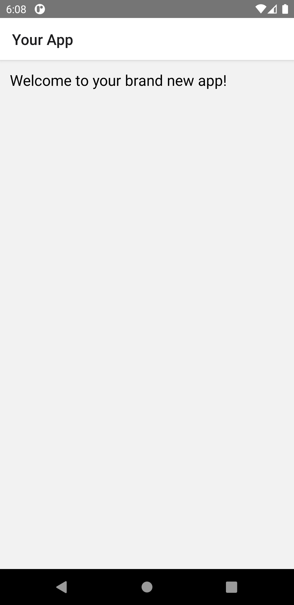 | 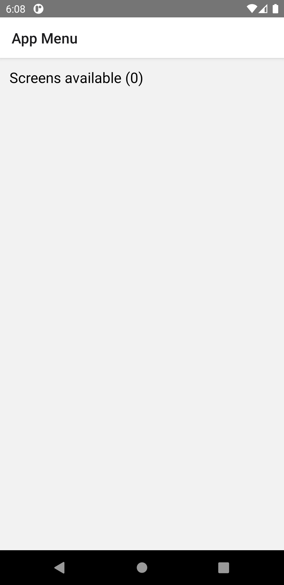 | 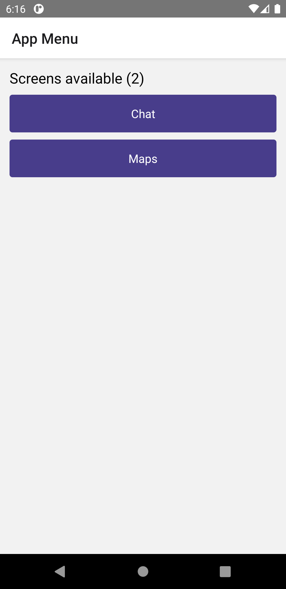 |

| Article list                      | Article detail                  | Chat list                       | Typing view                      | Privacy Policy                                |
| --------------------------------- | ------------------------------- | ------------------------------- | -------------------------------- | --------------------------------------------- |
|  |  |  | 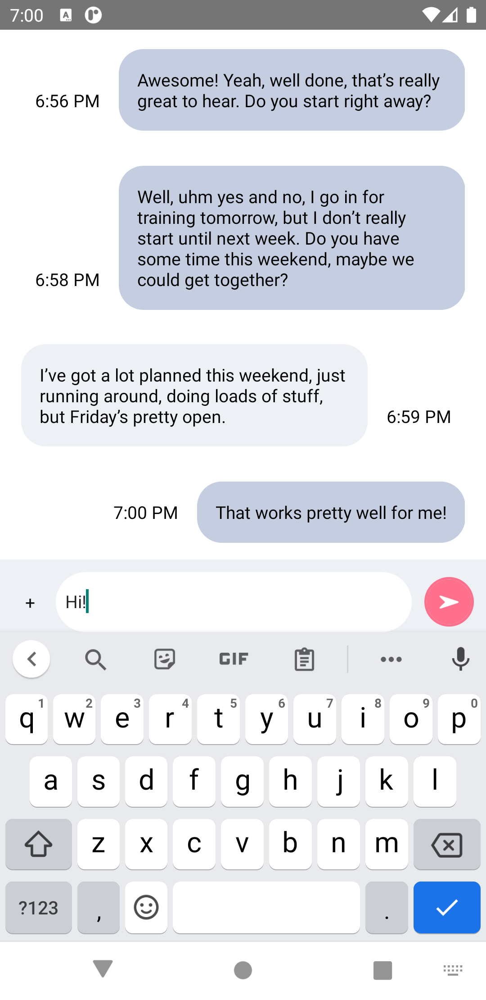 | 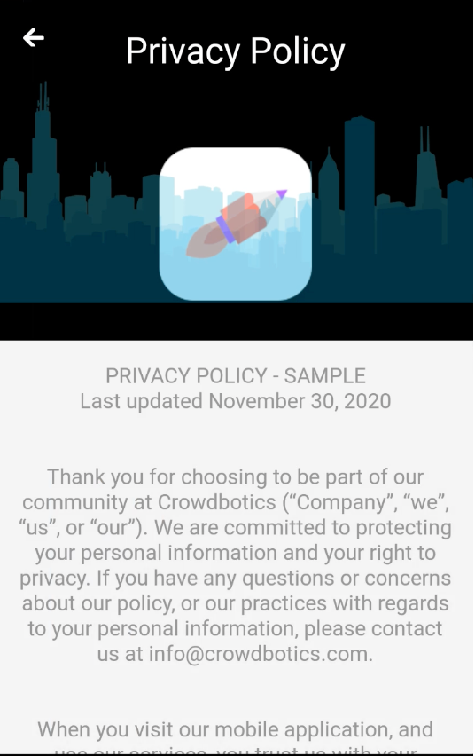 |

| Login screen                       | Maps                      | Maps                         | Pubnub integration                       | User Profile                              |
| ---------------------------------- | ------------------------- | ---------------------------- | ---------------------------------------- | ----------------------------------------- |
| 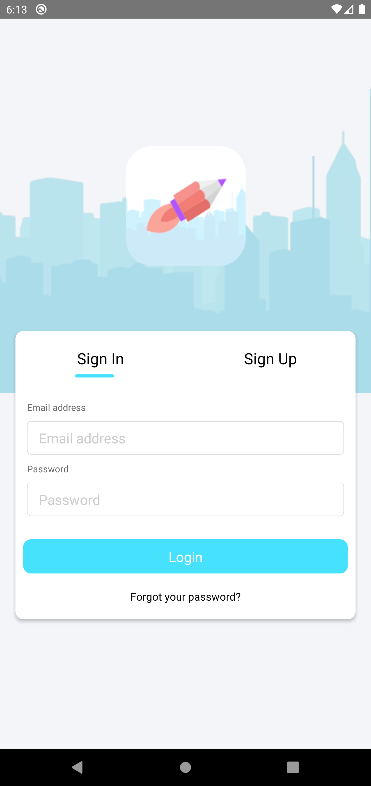 | 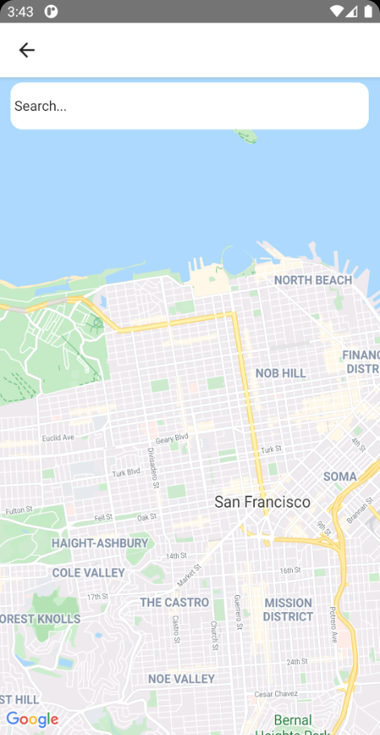 | 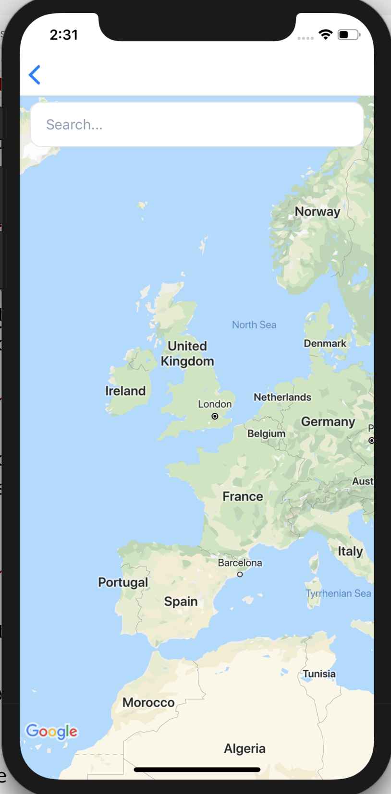 |  | 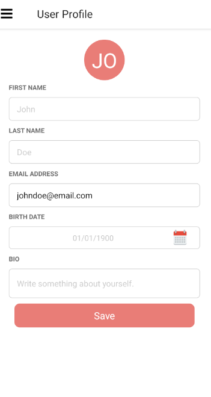 |

| Onboarding                            | Splash                      | Terms and Conditions                       | Message list                       | User Profile 2                               |
| ------------------------------------- | --------------------------- | ------------------------------------------ | ---------------------------------- | -------------------------------------------- |
|  |  | 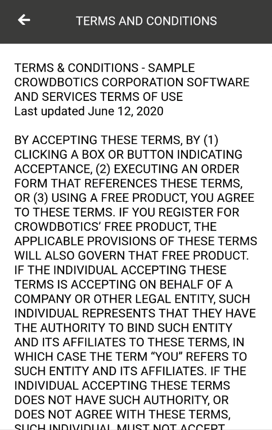 | 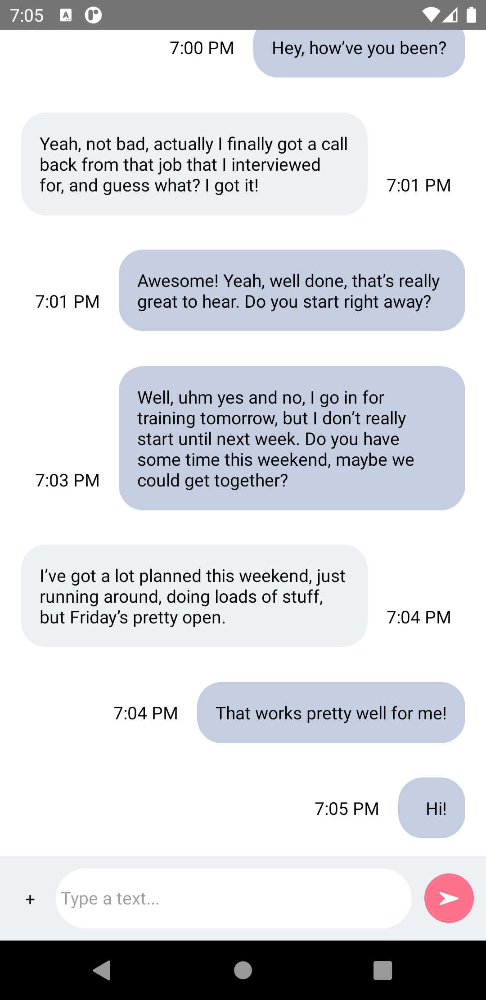 |  |

# Commands

## Requirements

Node LTS (14.15.4) is required, we depend on relatively new `fs` calls.

## Generate modules data JSON

```sh
npm run parse
```

Run the command to generate the JSON data, ready to be pasted in the Admin for updates or new modules creation.

In our `crowdbotics-slack-app` backend we support two flags on each file:

- `parentDir` - default to `src/features/<module_name>` if null, or use it otherwise
- `newFile` - undocumented/unimplemented?

### Create records in the admin panel

- [Staging Admin](https://crowdbotics-slack-dev.herokuapp.com/admin)
- [Production Admin](https://app.crowdbotics.com/admin)

### Use the following Component field values

**App Types:**

```text
3
```

Check **Auto build** and **Is screen**.

**Options:**

```json
{ "x": 0, "y": 0, "domTree": "" }
```

**Code:**
Copy from:

- [django.json](django.json)
- [react-native.json](react-native.json)

**Setup step:**

```text
To properly configure this module, follow the instructions given in README.md inside the module folder.
```

## Get module info

```sh
npm run info <module_name>
```

Prints the module name, description and the respective data JSON.

## Create a local demo app

```sh
npm run demo
```

This command runs `npx react-native init` with [`--template`](https://github.com/react-native-community/cli/tree/master/packages/global-cli#--template) pointing to our own [Custom React Native template](#custom-react-native-template).

## Install a module

```sh
npm run add <module_name> <supports_multiple_modules_syntax>
```

Installs a module into the demo app, performing the follow operations:

1. Copies the module directory from [react-native](react-native) into `demo/src/modules`.
2. Runs `yarn add <module_name>` in the `demo` directory.
3. Runs `yarn add <dependency>` for every `x-dependencies` in the module `package.json`.
4. Adds the module to `demo/src/modules/manifest.js` - with an import and an array export.

## Remove a module

```sh
npm run remove <module_name> <supports_multiple_modules_syntax>
```

Removes a module from the demo app, performing the follow operations:

1. Removes the module folder from `demo/src/modules`.
2. Runs `yarn remove <module_name>` in the `demo` directory.
3. Runs `yarn remove <dependency>` for every `x-dependencies` in the module `package.json`.
4. Remove the module from `demo/src/modules/manifest.js` - removing the import and the item from the export array.

# Auto loading and setting up modules

## App Menu module

We provide a module called "App Menu" that automatically lists available routes:

| Chat and Maps installed                        | No modules installed                       |
| ---------------------------------------------- | ------------------------------------------ |
|  |  |

```javascript
function AppMenu({ navigation }) {
  const routes = useNavigationState((state) =>
    state.routeNames.filter((name) => name !== "App Menu")
  );
  const links = routes.map((route) => {
    return (
      <Pressable
        onPress={() => navigation.navigate(route)}
        style={pressed}
        key={route}
      >
        <Text style={styles.buttonText}>{route}</Text>
      </Pressable>
    );
  });
  return (
    <View style={styles.container}>
      <Text style={styles.text}>Screens available ({routes.length})</Text>
      {links}
    </View>
  );
}
```

## Generate cookiecutter

```sh
npm run cookie
```

Generates cookiecutter template by replacing according to table:

| Before                     | After                                    | Example            |
| -------------------------- | ---------------------------------------- | ------------------ |
| `ProjectName`              | `{{ cookiecutter.project_slug }}`        | `MyNewApp`         |
| `projectname`              | `{{ cookiecutter.project_dash_slug }}`   | `mynewapp`         |
| `ProjectNameIdentifier`    | `{{ cookiecutter.project_dash_slug }}`   | `mynewapp`         |
| `ProjectOwnerEmail`        | `{{ cookiecutter.owner_email }}`         | `mail@example.com` |
| `ProjectSSHKeyFingerPrint` | `{{ cookiecutter.ssh_key_fingerprint }}` | `abc:123`          |

## Metro config

Our modules and template are written in a way that no user setup is required. We also make use of some simple scripts to update a manifest that lists the modules installed and we pick up from that to load them.

This section explains the mechanisms of this setup.

A good place to start is our `metro.config.js` config:

[template/source/metro/config.js](template/source/metro/config.js)

```javascript
/**
 * Metro configuration for React Native
 * https://github.com/facebook/react-native
 *
 * @format
 */

const path = require("path");
const extraNodeModules = {
  "@modules": path.resolve(__dirname, "src", "modules"),
};
const watchFolders = [path.resolve(__dirname + "/src/modules")];
module.exports = {
  transformer: {
    getTransformOptions: async () => ({
      transform: {
        experimentalImportSupport: false,
        inlineRequires: false,
      },
    }),
  },
  resolver: {
    extraNodeModules: new Proxy(extraNodeModules, {
      get: (target, name) =>
        //redirects dependencies referenced from src/modules to local node_modules
        name in target
          ? target[name]
          : path.join(process.cwd(), "node_modules", name),
    }),
  },
  watchFolders,
};
```

We make use of the Metro's Resolver [extraNodeModules](https://facebook.github.io/metro/docs/configuration/#extranodemodules) option to make use of local `npm` libraries installed into the app's `src/modules` directory (directory where modules get installed).

This gives us three main benefits:

- **Modularity** - We can author modules as npm packages and include their own dependencies that get installed when installing the module.
- **Developer Experience** - Making changes to those files also work with the metro [hot reload](https://facebook.github.io/metro/docs/configuration/#watchfolders).
- **Imports redirects** - Because managing `node_modules` on every `src/modules` folder isn't the best user experience, we redirect any import to the main app's `node_modules`. This means that a module can import from its own files or from any library, without issues.

## Using @modules

Notice the `@modules` key above, which means that we can import `src/modules/index.js` like this:

```javascript
import modules from "@modules";
```

And the default export of that module is just the components themselves:

[template/source/src/modules/index.js](template/source/src/modules/index.js)

```javascript
import React from "react";
import { View, Text, StyleSheet } from "react-native";
import { manifest } from "./manifest.js";
import { getPropertyMap } from "./utils.js";

const YourApp = () => {
  return (
    <View style={styles.container}>
      <Text style={styles.text}>Welcome to your brand new app!</Text>
    </View>
  );
};

// ...

export const slices = Object.entries(getPropertyMap(getModules(), "slice"));
export const navigators = Object.entries(
  getPropertyMap(getModules(), "navigator")
);
export const hooks = Object.entries(getPropertyMap(getModules(), "hook"));
export const initialRoute = getModules()[0].title;
export default getModules;
export default getModules();
```

The `slices` get imported into our `store.js` setup

[template/source/src/config/store.js](template/source/src/config/store.js)

```javascript
import {
  configureStore,
  createReducer,
  combineReducers,
} from "@reduxjs/toolkit";
import { slices } from "@modules";

export const APP_URL = "https://ProjectNameIdentifier.botics.co";

const reducers = slices.map((slice) => slice.reducer);

const appState = {
  name: "ProjectName",
  url: APP_URL,
  version: "1.0.0",
};

const appReducer = createReducer(appState, (_) => {
  return appState;
});

const reducer = combineReducers({
  app: appReducer,
  ...reducers,
});

const store = configureStore({
  reducer: reducer,
  middleware: (getDefaultMiddleware) => getDefaultMiddleware(),
});

export default store;
```

## Manifest

All of this dependends on the manifest defined here:

[template/source/src/modules/manifest.js](template/source/src/modules/manifest.js)

```javascript
export const modules = [];
```

This manifest dictates what modules are installed and by consequence get automatically setup with the mechanisms detailed above.

After installing the `maps` module i.e. it will look like this:

```javascript
import Maps from "./maps";
export const manifest = [Maps];
```

We make use of the `babel` and the transformer `ManifestTransformer` to manipulate this file content upon module's installations or removals.

[scripts/utils.js](scripts/utils.js)

```javascript
export class ManifestTransformer {
  constructor({ add, module }) {
    this.add = add;
    this.module = module;
    this.capitalizedModule = module
      .trim()
      .replace(/^\w/, (c) => c.toUpperCase());
  }

  visit(node) {
    if (this.add) {
      traverse.default(node, {
        // Push array element
        ArrayExpression: (path) => {
          let elements = path.node.elements;
          elements.push(types.identifier(this.capitalizedModule));
          path.replaceWith(types.arrayExpression(elements));
          path.skip();
        },
      });
      // Push Import
      node.program.body = [
        types.importDeclaration(
          [
            types.importDefaultSpecifier(
              types.identifier(this.capitalizedModule)
            ),
          ],
          types.stringLiteral(`./${this.module}`)
        ),
        ...node.program.body,
      ];
    } else {
      traverse.default(node, {
        // Filter array element
        ArrayExpression: (path) => {
          path.replaceWith(
            types.arrayExpression(
              path.node.elements.filter(
                (ele) => ele.name != this.capitalizedModule
              )
            )
          );
          path.skip();
        },
        // Filter import
        ImportDeclaration: (path) => {
          if (path.node.source.value == `./${this.module}`) {
            path.remove();
          }
        },
      });
    }
    return node;
  }
}
```

# Custom React Native template

**TODO**. Used in `npx react-native init`.

## What's included

Our template is on the latest React Native version (v0.63):
[template/source/package.json](template/source/package.json)

```json
  "dependencies": {
    "@reduxjs/toolkit": "^1.5.0",
    "react": "16.13.1",
    "react-native": "0.63.4",
    "react-native-dotenv": "^2.5.0",
    "react-redux": "^7.2.2",
    "redux": "^4.0.5"
  },
```

# Authoring Modules

## Guidelines

**DRAFT - work in progress section, and up to debate**

Modern React Native components guidelines:

- Prefer function components over class components
- Prefer React Hooks over React.component APIs
- Prefer react-redux Hooks over connect HOC
- Prefer redux-toolkit over custom redux logic setups
- Prefer redux-thunk over redux-saga
- Prefer pure components

## package.json

Your module's `main` key should always point to `index.js`. We also suggest that you name your module with a namespace prefix `@modules` like in the example below.

Your module can include its own dependencies, more on that in the following sections.

[react-native/maps/package.json](react-native/maps/package.json)

```json
{
  "name": "@modules/maps",
  "version": "1.0.0",
  "description": "## Setup",
  "private": true,
  "main": "index.js",
  "x-dependencies": {
    "react-native-maps": "0.27.1"
  },
  "author": "Crowdbotics",
  "license": "ISC"
}
```

There's a strict requirement on the format of your default export on your module's `index.js` file.

It should look like this:

```javascript
export default {
  title: "Maps", // required
  navigator: Maps, // optional
  slice: MapsSlice, // optional
};
```

The key `title` is required, everything else is optional and can be ommited.
We use this format to "auto-import" every module into the app automatically.

We also support plain exports:

```javascript
export default MapsNavigator;
```

Which would be converted into this object:

```javascript
export default {
  title: "MapsNavigator",
  navigator: MapsNavigator,
};
```

## Adding dependencies to your module

If you want to include libraries that your module depends upon and imports from, just include those as regular dependencies in the `package.json`.

```sh
npm install <dependency> -- save
```

Whenever the module gets the installed the dependencies of your module get installed in the app via npm's sub-dependencies.

If your library includes native code or depends on the [React Native's autolinking](https://github.com/react-native-community/cli/blob/master/docs/autolinking.md) feature please read the section below too.

## Adding dependencies with Native code

[React Native's autolinking](https://github.com/react-native-community/cli/blob/master/docs/autolinking.md) doesn't work yet with NPM's sub-dependencies.

Example, including `react-native-maps` in the maps module will not link the native
modules properly and results in

```
[Sat Jan 16 2021 16:23:45.446]  ERROR    Invariant Violation: requireNativeComponent: "AIRMap" was not found in the UIManager.
```

https://github.com/react-native-community/cli/issues/1347
https://github.com/react-native-maps/react-native-maps/issues/3427#issuecomment-627135604

In order to include `react-native-maps` in your module, simply move the dependency from "dependencies" to "x-dependencies" in your module's `package.json`. Those will be installed alongside the app's "dependencies" avoiding the limitation above.

## Running code on app load

Multiple scenarios and libraries require you to wrap your screen or other components (even your root component) to create context providers or to run initialization code.

Our auto-loading setup allows you to author a custom React hook on your module that gets automatically called in the app's root component.

In other words, any code that you would write inside your root component `componentDidMount` function can be instead written as a custom Hook.

To write the custom hook, please check the React documentation:
https://reactjs.org/docs/hooks-custom.html

And then export the hook in the module default export like below:

```javascript
const usePushNotifications = () => {
  const [someState, setSomeState] = useState(false);

  useEffect(() => {
    // ...
  });

  return someState;
};
export default {
  title: "Push Notifications",
  hook: usePushNotifications,
};
```

The example above is for an headless module (no screens), but you can export hooks in regular modules too.

# Resources

## Google

## Apple

### App's Capabilities (Entitlements)

> Key-value pairs that grant an executable permission to use a service or technology.

Documentation - https://developer.apple.com/documentation/bundleresources/entitlements
File - [ProjectName.entitlements](template/source/ios/ProjectName/ProjectName.entitlements)

**Examples**

iOS Push Notifications - `aps-environment`

```xml-property-list
<?xml version="1.0" encoding="UTF-8"?>
<!DOCTYPE plist PUBLIC "-//Apple//DTD PLIST 1.0//EN" "http://www.apple.com/DTDs/PropertyList-1.0.dtd">
<plist version="1.0">
<dict>
  <key>aps-environment</key>
  <string>development</string>
</dict>
</plist>
```
