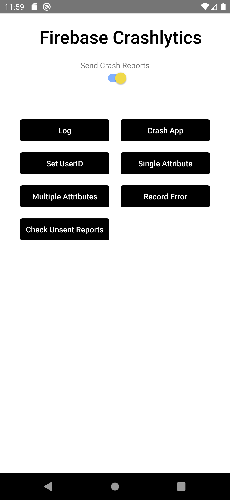

# Firebase Crashlytics React native specs

## Module description

This module can be used to do crash reporting in a react native app.

- Enable or disable crash reporting
- Log messages to console.
- Simulate an app crash.
- Set user id
- Create single attribute
- Create multiple attributes
- Record error
- Check Unsent reports



## ## Features

- [ ] This module includes environment variables.
- [x] This module requires manual configurations.
- [ ] This module can be configured with module options.
- [x] This module requires manual Android setup.
- [x] This module requires manual iOS setup.

## ## 3rd party setup

A firebase account is required.

1. Go To Firebase console and create a new project.
   [Firebase Console](https://console.firebase.google.com/)

2. Write your project name, accept terms & conditions and click on continue
3. Click on the android icon on the firebase dashboard to setup application Write your app name and register.

4. If you want to use Crashlytics in debug mode, add a file to the base folder of your project with the name firebase.json and paste the following contents into it:

```js
{
  "react-native": {
    "crashlytics_debug_enabled": true
  }
}
```

## Dependencies

Dependencies used:

- react-native-firebase/app - https://www.npmjs.com/package/@react-native-firebase/app
- react-native-firebase/crashlytics - https://www.npmjs.com/package/@react-native-firebase/crashlytics

## ## Module Options

### Global Configs

No global configs required.

### Local Configs

No local configs required.

### Android setup

1. Download the google-services.json file and place it inside of your project at the following location: `/android/app/google-services.json`.

2. Add the google-services plugin as a dependency inside of your `/android/build.gradle` file:

```gradle
buildscript {
  dependencies {
    // ... other dependencies
    classpath 'com.google.gms:google-services:4.3.15'
    classpath 'com.google.firebase:firebase-crashlytics-gradle:2.9.9'
  }
}
```

3. Lastly, execute the plugin by adding the following to your `/android/app/build.gradle` file:

```gradle
apply plugin: 'com.google.gms.google-services'
apply plugin: 'com.google.firebase.crashlytics'
```
### iOS setup

1. Download the GoogleService-Info.plist and place it in the root iOS folder
2. open your `/ios/{projectName}/AppDelegate.mm `file (or `AppDelegate.m` if on older react-native), and add the following:

At the top of the file, import the Firebase SDK right after '#import "AppDelegate.h"':

```c
#import <Firebase.h>
```

3. Within your existing didFinishLaunchingWithOptions method, add the following to the top of the method:

```c
- (BOOL)application:(UIApplication *)application didFinishLaunchingWithOptions:(NSDictionary *)launchOptions {
  // Add me --- \/
  [FIRApp configure];
  // Add me --- /\
  // ...
}
```

4. Beginning with firebase-ios-sdk v9+ (react-native-firebase v15+) you must tell CocoaPods to use frameworks.

Open the file ./ios/Podfile and add this line inside your targets (right after the line calling the react native Podfile function to get the native modules config):

```c
use_frameworks! :linkage => :static

```

5. To use Static Frameworks on iOS, you also need to manually enable this for the project with the following global to your /ios/Podfile file:

```c
# right after `use_frameworks! :linkage => :static`
$RNFirebaseAsStaticFramework = true
```
