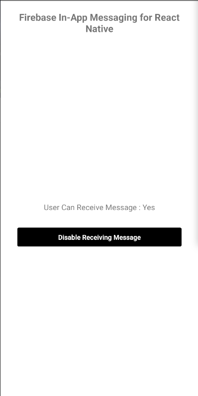

# Firebase In-App Messages React native specs

## Module description

This react native based module allows user to recieve in app messages generated from firebase.

- Enable or Disable message recieving
- Recieve messages in following formats:
- Card
- Modal
- Image only
- Top-banner



## ## Features

 - [ ] This module includes environment variables.
 - [x] This module requires manual configurations.
 - [ ] This module can be configured with module options.
 - [x] This module requires manual Android setup.
 - [x] This module requires manual iOS setup.

## ## 3rd party setup

A firebase account is required.

1. Go To Firebase console and create a new project.
   [Firebase Console](https://console.firebase.google.com/)
2. Write your project name, accept terms & conditions and click on continue
3. Click on the android icon on the firebase dashboard to setup application Write your app name and register.
4. Now register another app for iOS.

## Dependencies

Dependencies used:
- @react-native-firebase/app - https://www.npmjs.com/package/@react-native-firebase/app
- @react-native-firebase/in-app-messaging  -  https://www.npmjs.com/package/@react-native-firebase/messaging
- @react-native-firebase/analytics - https://www.npmjs.com/package/@react-native-firebase/analytics

## ## Module Options

### Global Configs

No global configs required.

### Local Configs

No local configs required.

### Testing Scenarios

You can install `@react-native-firebase/installations` library to get a firebase installation id and test it through the console.


Firebase In-App messages can be triggered based on predefined events or custom events that you define while creating a campaign

In your Firebase In-App Messaging campaign, you can set up custom event triggers. These triggers determine when the in-app message should be displayed to users based on custom events you define in your app.

In your app's code, implement event tracking logic for the custom event you've defined. When the event occurs, you should log it using the Firebase Analytics SDK.

Now when the custom event is triggered, your In-App message should be displayed shortly after.

### Android setup

1. Download the `google-services.json` file and place it inside of your project at the following location: `/android/app/google-services.json`.

2. Add the google-services plugin as a dependency inside of your `/android/build.gradle` file:

```gradle
buildscript {
  dependencies {
    // ... other dependencies
    classpath 'com.google.gms:google-services:4.3.15'
  }
}
```

3. Lastly, execute the plugin by adding the following to your `/android/app/build.gradle` file:

```gradle
apply plugin: 'com.google.gms.google-services'
```

### iOS setup

1. Download the `GoogleService-Info.plist` and add it in the root `/ios` folder
2. Open your `/ios/{projectName}/AppDelegate.mm `file (or `AppDelegate.m` if on older react-native), and add the following:

At the top of the file, import the Firebase SDK right after `#import "AppDelegate.h"`:

```c
#import <Firebase.h>
```

3. Within your existing didFinishLaunchingWithOptions method, add the following to the top of the method:

```c
- (BOOL)application:(UIApplication *)application didFinishLaunchingWithOptions:(NSDictionary *)launchOptions {
  // Add me --- \/
  [FIRApp configure];
  // Add me --- /\
}
```
