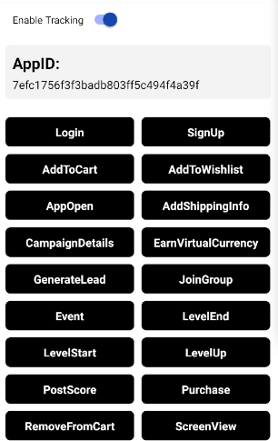

# Google Analytics(firebase) React native specs

## Module description

The Google Analytics(firebase) Module is a React Native-based module that allows the user to get insight into how users engage with his app and app’s marketing performance on his firebase dashboard.

- Ability to signify that a user has logged in/signed up
- Ability to report continuous engagement of app-users.
- Ability to signify that an item was added/removed.
- Ability to signify that a user has submitted their payment information to your app.
- Ability to identify the most popular content in your app.
- Ability to identify the most shared content.
- Ability to signifies the start/completion of the on-boarding process in app.
- Ability to identify the screen user is currently viewing.




## ## Features

 - [ ] This module includes environment variables.
 - [x] This module requires manual configurations.
 - [ ] This module can be configured with module options.
 - [x] This module requires manual Android setup.
 - [x] This module requires manual iOS setup.

## ## 3rd party setup

- If you don't already have one, you'll need a Google Analytics account. You can create one by visiting     [Google Analytics](https://analytics.google.com/).
- You'll also need a working `firebase account`.

## Dependencies

Dependencies used:
- @react-native-firebase/app - https://www.npmjs.com/package/@react-native-firebase/app
- @react-native-firebase/analytics - 
https://www.npmjs.com/package/@react-native-firebase/analytics

## ## Module Options

### Global Configs

No global configs required.

### Local Configs

No local configs required.

### Android setup

1. On the Firebase console, add a new Android application and enter your projects details. The "Android package name" must match your local projects package name which can be found inside of the manifest tag within the `/android/app/src/main/AndroidManifest`.xml file within your project.

2. Download the google-services.json file and place it inside of your project at the following location: `/android/app/google-services.json`.

3. Add the google-services plugin inside of your `/android/build.gradle` file:

```gradle
buildscript {
    repositories {
   
    google()  // Google's Maven repository

  }

  dependencies {

    classpath 'com.google.gms:google-services:4.3.10'
   
  }
}

  allprojects {

  repositories {

    google()  // Google's Maven repository

  }
}
```

4. Lastly, execute the plugin by adding the following lines of code to your /android/app/build.gradle file:

```gradle
apply plugin: 'com.google.gms.google-services'

dependencies {

  implementation platform('com.google.firebase:firebase-bom:30.1.0')
  implementation 'com.google.firebase:firebase-analytics'

}
```
### iOS setup

On the Firebase console, add a new iOS application and enter your projects details. The "iOS bundle ID" must match your local project bundle ID. The bundle ID can be found within the "General" tab when opening the project with Xcode.
Download the `GoogleService-Info.plist` file.

1. Using Xcode, open the projects /ios/{projectName}.xcodeproj file (or /ios/{projectName}.xcworkspace if using Pods).

   Right click on the project name and "Add files" to the project, as demonstrated below:
   

Select the downloaded GoogleService-Info.plist file from your computer, and ensure the "Copy items if needed" checkbox is enabled.


2. Then in appDelegate.mm file import this on top.
```c
#import <Firebase.h>
```

3. Then add this line at the start of the didFinishLaunchingWithOptions method.
```c
if ([FIRApp defaultApp] == nil) { [FIRApp configure]; }
```

For `react native 0.71` you’ll also need to follow some extra steps to properly initialize Firebase in your project.  

1. Add these two lines under `config = use_native_modules!`
```powershell
use_frameworks! :linkage => :static # for Firebase
  $RNFirebaseAsStaticFramework = true
```
2. Comment this line
```powershell
:flipper_configuration => flipper_config,
```
3. Now add this line above targets

```powershell
$FirebaseSDKVersion = '10.4.0' # for Firebase
```

4.Add all the below code after post_install method

```powershell
installer.pods_project.targets.each do |target|
      target.build_configurations.each do |config|
        config.build_settings["GCC_WARN_INHIBIT_ALL_WARNINGS"] = "YES"
      end
    end
    installer.pods_project.targets.each do |target|
      target.build_configurations.each do |config|
        config.build_settings["CC"] = "clang"
        config.build_settings["LD"] = "clang"
        config.build_settings["CXX"] = "clang++"
        config.build_settings["LDPLUSPLUS"] = "clang++"
      end
    end
    installer.aggregate_targets.each do |aggregate_target|
      aggregate_target.user_project.native_targets.each do |target|
        target.build_configurations.each do |config|
          config.build_settings['ONLY_ACTIVE_ARCH'] = 'YES'
          config.build_settings['EXCLUDED_ARCHS'] = 'i386'
        end
      end
      aggregate_target.user_project.save
    end
    installer.pods_project.targets.each do |target|
      if (target.name.eql?('FBReactNativeSpec'))
        target.build_phases.each do |build_phase|
          if (build_phase.respond_to?(:name) && build_phase.name.eql?('[CP-User] Generate Specs'))
            target.build_phases.move(build_phase, 0)
          end
        end
      end
    end
    installer.pods_project.targets.each do |target|
      target.build_configurations.each do |config|
        config.build_settings["ENABLE_BITCODE"] = "NO"
      end
    end
  end
end
```
7. Now run `pod install`
