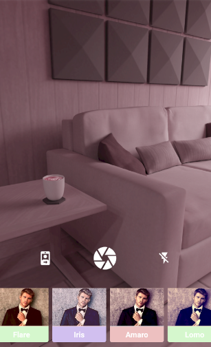

# Live camera filters React native specs

## Module description

Live camera filters module enables the user to apply filters in real time on the photos while taking a picture.

1. Ability to take picture from camera.
2. Ability to apply filters on photo while taking picture. Here is list of available filters:
   * Negative
   * Sharp
   * Vintage
   * Flare
   * Iris
   * Amaro
   * Lomo
   * Sepia
3. Ability to switch camera direction.
4. Ability to to switch flash on/off.
5. Ability to save the picture.




## ## Features

 - [ ] This module includes environment variables.
 - [X] This module requires manual configurations.
 - [ ] This module can be configured with module options.
 - [x] This module requires manual Android setup.
 - [ ] This module requires manual iOS setup.

## ## 3rd party setup

No 3rd party account creation required

## Dependencies

Link to the READMEs of the packages that you used in this module.

Dependencies used:
- react-native-filter-camera  https://www.npmjs.com/package/react-native-filter-camera

- @react-native-camera-roll/camera-roll  https://www.npmjs.com/package/@react-native-camera-roll/camera-roll

- react-native-vector-icons  https://www.npmjs.com/package/react-native-vector-icons

## ## Module Options

### Global Configs

No global configs

### Local Configs

No Local configs

### Android setup

1. Open up `android/app/src/main/java/[...]/MainApplication.java` Add following line to the imports at the top of the file.

```
    import com.reactnativefiltercamera.FilterCameraPackage;
``` 
2. Add following line of code in `android/app/src/main/java/[...]/MainApplication.java` as well.

Add below line in getPackages function

```
    packages.add(new FilterCameraPackage());
```
3. Add the following lines of code in `android/app/src/main/AndroidManifest.xml` to get the permissions.

```xml
    <uses-permission android:name="android.permission.CAMERA" />
    <uses-permission android:name="android.permission.RECORD_AUDIO"/>
    <uses-permission android:name="android.permission.READ_EXTERNAL_STORAGE" />
    <uses-permission android:name="android.permission.WRITE_EXTERNAL_STORAGE" />
    <uses-permission android:name="android.permission.INTERNET" />
```

### iOS setup

No iOS setup required
