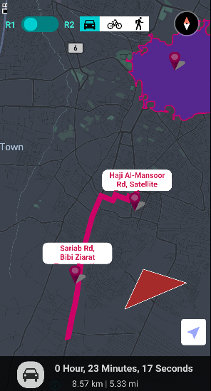

# MapBox Maps React native specs

## Module description

MapBox Maps module is a react-native based module. Helps user to search and navigate to the required locations.
Using this module users will implement a dynamic, highly customized, and optimized map for various use cases or design their own custom style map.

- Display the map
- Set the custom markers
- Add custom annotations on the map
- Ability to draw polylines and polygons between coordinates
- Add custom layers on map
- Change the label fonts, color, and sizes on the map.
- Change the streets, buildings, and water theme colors
- Ability to mark the point of interest on the map.
- Get the distance and duration between the origin and destination
- Get the routes according to the walking, cycling, and driving mode.
- Ability to get the other possible route to the destination



## ## Features

- [x] This module includes environment variables.
- [x] This module requires manual configurations.
- [x] This module can be configured with module options.
- [x] This module requires manual Android setup.
- [x] This module requires manual iOS setup.

## ## 3rd party setup

1. Login to [MapBox Developer Account](https://account.mapbox.com/auth/signin/).
2. To create a private token click on `+ Create a token` button.
3. Select the required scopes and click `create token` button.
4. Copy the new created token and save it for later use.


#### Design a custom map style

1. On your [Account Page](https://account.mapbox.com/), Click `Create map in studio ->` button.
2. On next page, click `New style` button.
3. Choose a template and click `customize template` button.
4. Customize your map and click `publish` button to save the map styles.
5. Your map will be displayed on the Style page.
6. click `:` button and copy the `styleURL` which will look something like this `mapbox://styles/{your_account}/xxxxxxxxxxxx`.


## Dependencies

Dependencies used:

- @rnmapbox/maps - https://www.npmjs.com/package/@rnmapbox/maps
- @turf/helpers - https://www.npmjs.com/package/@turf/helpers
- react-native-switch-toggle - https://www.npmjs.com/package/react-native-switch-toggle
- react-native-vector-icons - https://www.npmjs.com/package/react-native-vector-icons

## ## Module Options

### Global Configs

No global configs required.

### Local Configs

#### Configure your secret token

To avoid exposing your secret token, add it as an environment variable:

1. Find or create a gradle.properties file in your Gradle user home folder.
2. The folder can be found at `USER_HOME >> .gradle`.
3. Once you have found or created the file, its path should be `USER_HOME >> .gradle >> gradle.properties`.
4. Add your secret token your `gradle.properties` file:

   ```
   MAPBOX_DOWNLOADS_TOKEN=YOUR_SECRET_MAPBOX_ACCESS_TOKEN
   ```

   Update the following options in `mapbox-map/options.js`.

#### Update `options.js` file

```js
const MAPBOX_TOKEN = MapBox Secret Token generated above in MapBox Credentials section.
const mapStyleURL = Map `styleURL`
const ORIGIN = Initial location for the map
const GOOGLE_API_KEY = "Your google api key";
const POLYGON = Update the polygon object to draw shape on the map
const MARKED_CENTERED = An array containing longitude and latitude;
const MAP_SETTINGS = settings for map
```

### Android setup

1. In `android/app/src/main/res/values/strings.xml` file and add the following string resource,

```xml
<string name="mapbox_access_token">YOUR_MAPBOX_ACCESS_TOKEN</string>
```

2. Overwrite mapbox dependencies within your `android/build.gradle > buildscript > ext` section

```gradle
buildscript {
    ext {
        // ...
        RNMapboxMapsImpl = "mapbox"

    }
}
```

3. Then under section allprojects/repositories add your data:

```gradle
// android/build.gradle

allprojects {
    repositories {
        // ...other repos
        maven {
            url 'https://api.mapbox.com/downloads/v2/releases/maven'
            authentication {
                basic(BasicAuthentication)
            }
            credentials {
                // Do not change the username below.
                // This should always be `mapbox` (not your username).
                username = 'mapbox'
                // Use the secret token you stored in gradle.properties as the password
                password = project.properties['MAPBOX_DOWNLOADS_TOKEN'] ?: ""
            }
        }
        // ...even more repos?
    }
}
```

### iOS setup

1. Add the following to your ios/Podfile:

```pod
  pre_install do |installer|
    $RNMapboxMaps.pre_install(installer)
    ... other pre install hooks
  end
  post_install do |installer|
    $RNMapboxMaps.post_install(installer)
    ... other post install hooks
  end
```

2. Running pod install download the proper mapbox dependency

```
cd ios

pod install
```
