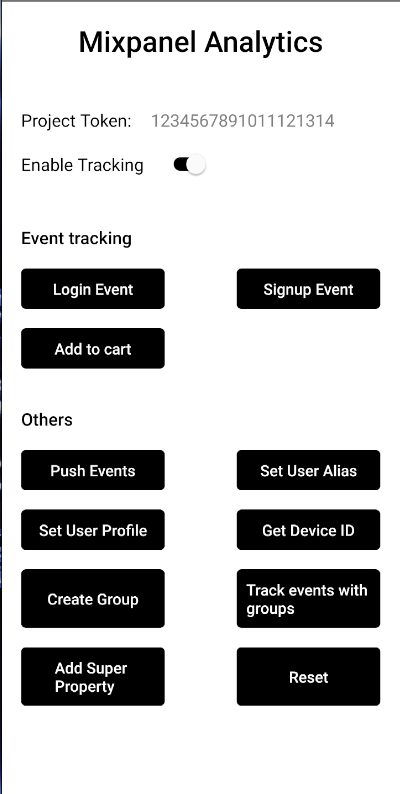

# Mixpanel Analytics React native specs

## Module description

This module can be used to integrate Mixpanel with your react native app and provide valuable insights and analytics.

- Enable/Disable tracking
- Event tracking
- Push Events forcefully
- Set alias for user
- Update user profile
- Fetch device ID
- Create groups
- Track events with groups
- Register Super properties
- Reset



## ## Features

- [x] This module includes environment variables.
- [x] This module requires manual configurations.
- [x] This module can be configured with module options.
- [ ] This module requires manual Android setup.
- [ ] This module requires manual iOS setup.

## ## 3rd party setup

1. If you don't already have a Mixpanel account, go to the Mixpanel website (https://mixpanel.com/) and sign up for an account. You can choose a free plan or a paid plan based on your needs.

2. After signing up and logging into Mixpanel, create a new project for your React Native app. Follow the on-screen instructions to set up your project. You will be asked to name your project, specify the platform (in this case, "Mobile"), and choose a data retention plan.

3. Once your project is created, you will receive a unique project token. This token is essential for tracking events and user data in your React Native app. Make sure to keep it secure, as it acts as an API key for your Mixpanel project.

## Dependencies

Dependencies used:

- mixpanel-react-native - https://www.npmjs.com/package/mixpanel-react-native?activeTab=readme

## ## Module Options

### Global Configs

No global configs required.

### Local Configs

Update these values in `options.js` file

```js
const trackAutomaticEvents = true;
const projectToken = "";
```

### Android setup

No android setup required.

### iOS setup

No iOS setup required.

### Mixpanel methods

#### 1. Event tracking

This method can be used to track all sorts of events containing all sorts of properties. Every call to track eventually results in a data point sent to Mixpanel. Events have a string name, and an optional set of name/value pairs that describe the properties of that event.

```js
track("addToCart", {
      productName: "Book",
      price: "$25"
    });
```

#### 2. Flush

Events and People messages are pushed gradually throughout the lifetime of your application. This means that to ensure that all messages are sent to Mixpanel when your application is shut down, you will need to call flush() to let the Mixpanel library know it should send all remaining messages to the server.

```js
flush();
```

#### 3. Set User alias

The alias method creates an alias which Mixpanel will use to remap one id to another. Multiple aliases can point to the same identifier. `mixpane.alias("New ID", mixpane.distinctId)` `mixpane.alias("Newer ID", mixpane.distinctId)`

```js
alias(alias, distinctId);
```

#### 4. Get Device ID

Returns the current device id of the device. This id automatically generated by the library and regenerated when logout or reset is called. example of usage:

```js
const deviceId = await mixpanel.getDeviceId();
```

#### 5. Create Group

Returns a MixpanelGroup object that can be used to set and increment Group Analytics properties.

```js
getGroup(groupKey, groupID);
```

#### 6. Track Events with groups

Track an event with specific groups.

```js
trackWithGroups(eventName, properties, groups);
```

#### 7. Add Super Property

Register properties that will be sent with every subsequent call to track().

```js
registerSuperProperties(properties);
```

#### 8. Reset

Clear super properties and generates a new random distinctId for this instance. Useful for clearing data when a user logs out.

```js
reset();
```

[Doc Link for react-native](https://mixpanel.github.io/mixpanel-react-native/Mixpanel.html)
