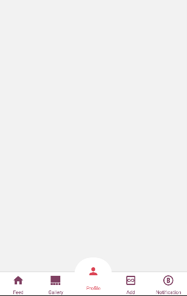

# Navigation Tabs React native specs

## Module description

The Navigation tabs module is a React Native based module, helps the user to use dynamic tabs, set the position of tabs, change icons and customize styling.

- Dynamic Tabs.
- Swipe tabs.
- Scrollable tabs.
- Tab customization.
- Add icons on tabs icon.
- Change tab layout



## ## Features

 - [ ] This module includes environment variables.
 - [ ] This module requires manual configurations.
 - [x] This module can be configured with module options.
 - [ ] This module requires manual Android setup.
 - [ ] This module requires manual iOS setup.

## ## 3rd party setup

No 3rd party account required.

## Dependencies

Dependencies used:
- @react-navigation/bottom-tabs - https://www.npmjs.com/package/@react-navigation/bottom-tabs
- react-native-vector-icons - https://www.npmjs.com/package/react-native-vector-icons
- prop-types - https://www.npmjs.com/package/prop-types

## ## Module Options

### Global Configs

No global configs required.

### Local Configs

You can update the tabList in `options.js` file as well.

```js
const tabList = [
  {
     name: "Gallery",
      component: Gallery,
      label: "Gallery",
      tabIcon: ({ color, size }) => (
        <MaterialCommunityIcons name="view-gallery" color={color} size={size} />
      ),
      tabBarIconStyle: {color: "black"},
      tabBarBadge: 2,
      tabBarBadgeStyle: {color: "black"},
      tabBarLabelStyle: {fontSize: 14},
      tabBarItemStyle:{backgroundColor: "blue"}
  },
  ...
]
```
You can pass the props to the component by calling component like an inline function, like this:
```js
const tabList = [
  {
    ...
    component: () => Gallery("1234"),
    ...
  },
  ...
]
```

### Android setup

No android setup required.


### iOS setup

No iOS setup required.
