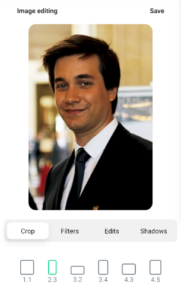

# Photo Editing React native specs

## Module description

The module allows users to edit photo, by applying filters, contrast, opacity, resizing, crop etc.

- Crop
- Filters
- Edits
- Shadows



## ## Features

 - [ ] This module includes environment variables.
 - [ ] This module requires manual configurations.
 - [ ] This module can be configured with module options.
 - [x] This module requires manual Android setup.
 - [x] This module requires manual iOS setup.

## ## 3rd party setup

No 3rd party account required.

## Dependencies

Dependencies used:

- gl-react - https://www.npmjs.com/package/gl-react
- gl-react-native - https://www.npmjs.com/package/gl-react-native
- react-native-gl-image-filters - https://www.npmjs.com/package/react-native-gl-image-filters
- react-native-unimodules - https://www.npmjs.com/package/react-native-unimodules
- @react-native-community/slider - https://www.npmjs.com/package/@react-native-community/slider
- react-native-image-resizer - https://www.npmjs.com/package/react-native-image-resizer
- react-native-image-picker - https://www.npmjs.com/package/react-native-image-picker
- @react-native-community/cameraroll - https://www.npmjs.com/package/@react-native-community/cameraroll
- @react-navigation/native-stack - https://www.npmjs.com/package/@react-navigation/stack
- react-native-screens - https://www.npmjs.com/package/react-native-screens
- react-native-calendars - https://www.npmjs.com/package/react-native-calendars

## ## Module Options

### Global Configs

No global configs required.

### Local Configs

No local configs required.

### Android setup

#### Configuration for react-native-unimodules

1. Open up `android/app/src/main/java/[...]/MainApplication.java`. Add following lines to the imports at the top of the file.

```java
    import com.demo.generated.BasePackageList;
    import java.util.Arrays;
    import org.unimodules.adapters.react.ModuleRegistryAdapter;
    import org.unimodules.adapters.react.ReactModuleRegistryProvider;

```
2. Add following lines of code in `android/app/src/main/java/[...]/MainApplication.java` as well.

```java
    private final ReactModuleRegistryProvider mModuleRegistryProvider = new ReactModuleRegistryProvider(new BasePackageList().getPackageList(), null);
```

2. Add following lines of code in `android/app/src/main/java/[...]/MainApplication.java` as well.

Add below lines in getPackages function

```java
    List<ReactPackage> unimodules = Arrays.<ReactPackage>asList(
            new ModuleRegistryAdapter(mModuleRegistryProvider)
          );
          packages.addAll(unimodules);
```

3. Append the following lines to `android/settings.gradle`.

```gradle
    apply from: new File(["node", "--print", "require.resolve('react-native-unimodules/package.json')"].execute(null, rootDir).text.trim(), "../gradle.groovy"); includeUnimodulesProjects()
    apply from: new File(["node", "--print", "require.resolve('@react-native-community/cli-platform-android/package.json')"].execute(null, rootDir).text.trim(), "../native_modules.gradle"); applyNativeModulesSettingsGradle(settings)

```

4. Add following lines in `android/app/build.gradle`.

```gradle
    apply from: '../../node_modules/react-native-unimodules/gradle.groovy'
```

5. Add this line in dependencies block in `android/app/build.gradle`.

```gradle
    dependencies{
        addUnimodulesDependencies()
    }
```


#### Configuration for @react-native-community_camerarol

1. Open up `android/app/src/main/java/[...]/MainApplication.java`. Append the given lines to imports.

```java
    import com.reactnativecommunity.cameraroll.CameraRollPackage;

```
2. Append the following lines to `android/settings.gradle.`

```java
    include ':@react-native-community_cameraroll'
    project(':@react-native-community_cameraroll').projectDir = new File(rootProject.projectDir, 	'../node_modules/@react-native-community/cameraroll/android')
```
3. Add `android:requestLegacyExternalStorage="true" to AndroidManifest.xml`.

```xml
    <uses-permission android:name="android.permission.READ_EXTERNAL_STORAGE"/>
    <uses-permission android:name="android.permission.WRITE_EXTERNAL_STORAGE" />

```
```xml
    <application  android:requestLegacyExternalStorage="true" /> 
    </application>
```

#### Update buildScript in `android/build.gradle`
In android/build.gradle update your `buildTools`, `compileSdkVersion` and `targetSdkVersion` to at least version 30.
```javascript

buildToolsVersion = "30.0.3"
compileSdkVersion = 30
targetSdkVersion = 30

```

### iOS setup


#### Configuration for react-native-unimodules

1. In `ios/MyApp/AppDelegate.h`
```diff
- @interface AppDelegate : UIResponder <UIApplicationDelegate, RCTBridgeDelegate> //remove this line

+ #import <UMCore/UMAppDelegateWrapper.h>                                         //add these two lines
+ @interface AppDelegate : UMAppDelegateWrapper <UIApplicationDelegate, RCTBridgeDelegate>
```

2. In `ios/MyApp/AppDelegate.m`add following lines:

```c
#import <UMCore/UMModuleRegistry.h>
#import <UMReactNativeAdapter/UMNativeModulesProxy.h>
#import <UMReactNativeAdapter/UMModuleRegistryAdapter.h>
```

```c
@interface AppDelegate () <RCTBridgeDelegate>
 
@property (nonatomic, strong) UMModuleRegistryAdapter *moduleRegistryAdapter;
 
@end
```
```c
  self.moduleRegistryAdapter = [[UMModuleRegistryAdapter alloc] initWithModuleRegistryProvider:[[UMModuleRegistryProvider alloc] init]];
```

```c
[super application:application didFinishLaunchingWithOptions:launchOptions];
```

```c
- (NSArray<id<RCTBridgeModule>> *)extraModulesForBridge:(RCTBridge *)bridge
{
    NSArray<id<RCTBridgeModule>> *extraModules = [_moduleRegistryAdapter extraModulesForBridge:bridge];
    // If you'd like to export some custom RCTBridgeModules that are not Expo modules, add them here!
    return extraModules;
}
```

3. In `ios/Podfile `
```powershell
//Remove these two lines
require_relative '../node_modules/react-native/scripts/react_native_pods'
require_relative '../node_modules/@react-native-community/cli-platform-ios/native_modules'

//Add these lines
require File.join(File.dirname(`node --print "require.resolve('react-native/package.json')"`), "scripts/react_native_pods")
require File.join(File.dirname(`node --print "require.resolve('@react-native-community/cli-platform-ios/package.json')"`), "native_modules")
require File.join(File.dirname(`node --print "require.resolve('react-native-unimodules/package.json')"`), "cocoapods")
```
```
 platform :ios, '10.0' //remove this line
 platform :ios, '11.0' //add this line
```
```
 use_unimodules! //add this line
```
4. Install pods
```
npx pod-install
```

#### Configuration for @react-native-community_camerarol

1. In XCode, in the project navigator, right click `Libraries` ➜ `Add Files to [your project's name]`
2. Go to `node_modules` ➜ `@react-native-community/cameraroll` and add `RNCCameraroll.xcodeproj`
3. In XCode, in the project navigator, select your project. Add `libRNCCameraroll.a` to your project's `Build Phases` ➜ `Link Binary With Libraries`
4. Run your project `(Cmd+R)`<

