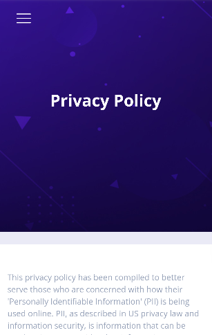

# Privacy Policy WebView React native specs

## Module description

Privacy Policy WebView is a React Native based Module, which displays Privacy Policy content through a URL.

- Ability to load the privacy policy content from a URL.



## ## Features

 - [x] This module includes environment variables.
 - [x] This module requires manual configurations.
 - [ ] This module can be configured with module options.
 - [ ] This module requires manual Android setup.
 - [ ] This module requires manual iOS setup.

## ## 3rd party setup

No 3rd party account required.

## Dependencies

Dependencies used:
- react-native-webview  -  https://www.npmjs.com/package/react-native-webview

## ## Module Options

### Global Configs

Update the ``options/options.js`` file with your app's backend url.
```
export const globalOptions = {
    ...
  url: "https://my-app.botics.co",
   ...
}
```

### Local Configs

In **modules/privacy-policy-webview/options.js** update `privacyUrl`.

```javascript

const privacyUrl = "";

```

### Android setup

No android setup required.

### iOS setup

No iOS setup required.
