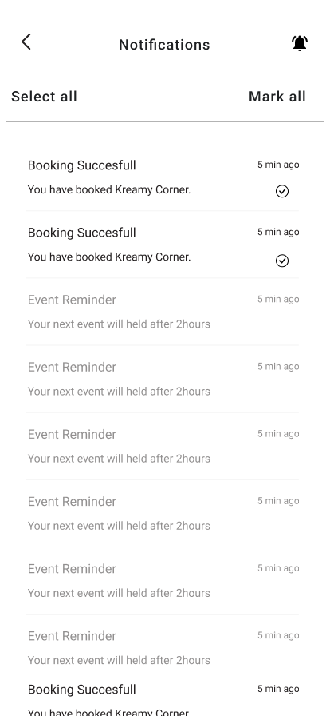

# Push Notifications React native specs

## Module description

This react native based module allows user to deliver personalized customer notifications using OneSignal.

- Recieve notifications from one signal.
- Increase Message Visibility
- Create a Connected User Experience
- Use highly visible push alerts to remind users
- Engage your users with updates and new content.



## ## Features

 - [x] This module includes environment variables.
 - [x] This module requires manual configurations.
 - [ ] This module can be configured with module options.
 - [x] This module requires manual Android setup.
 - [x] This module requires manual iOS setup.

## ## 3rd party setup

Following are the steps to get the keys & credientials:
1. Sign in to [oneSignal](https://onesignal.com/).
2. Create new app by clicking `New App/Website` button.
3. Enter the name of your app and select web push or mobile push.
4. Click `Configure your Platform` button.
5. Enter the `Firebase Server Key` and `Sender ID` and click `Save and Continue` button.
6. Select the type of your sdk and click `Save and Continue` button.
7. Copy the app id and click `Done` button.
8. Click on `Settings` tab in menubar.
9. Select `Keys & IDs` tab and copy `OneSignal App ID` and `Rest API Key` save them for later use.


## Dependencies

Dependencies used:
- react-native-onesignal - https://www.npmjs.com/package/react-native-onesignal

## ## Module Options

### Global Configs

No global configs required.

### Local Configs

Add `ONE_SIGNAL_APP_ID` in your `@env`

### Android setup


Add the following buildscript at the top of `android/app/build.gradle` file:

```
buildscript {
    repositories {
        maven { url 'https://plugins.gradle.org/m2/' } // Gradle Plugin Portal
    }
    dependencies {
        classpath 'gradle.plugin.com.onesignal:onesignal-gradle-plugin:[0.12.9, 0.99.99]'
    }
}

apply plugin: 'com.onesignal.androidsdk.onesignal-gradle-plugin'
```

### iOS setup

Follow and complete the [Step 4 of the OneSignal documentation](https://documentation.onesignal.com/docs/react-native-sdk-setup#step-4---install-for-ios-using-cocoapods-for-ios-apps).
