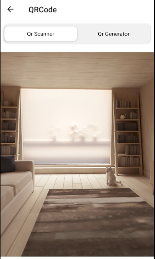

# QR code React native specs

## Module description

This module allows the user to generate qr-code by entering text and read a qr-code by taking a picture through device's camera.

- Generate a qr code by entering custom text
- Scan qr code through camera.



## ## Features

 - [ ] This module includes environment variables.
 - [x] This module requires manual configurations.
 - [ ] This module can be configured with module options.
 - [x] This module requires manual Android setup.
 - [x] This module requires manual iOS setup.

## ## 3rd party setup

No 3rd party account creation is required

## Dependencies

Dependencies used:

- react-native-camera  -  https://www.npmjs.com/package/react-native-camera
- react-native-pager-view  -  https://www.npmjs.com/package/react-native-pager-view
- react-native-tab-view  -  https://www.npmjs.com/package/react-native-tab-view
- @react-navigation/native-stack  -  https://www.npmjs.com/package/@react-navigation/native-stack
- react-native-screens  -  https://www.npmjs.com/package/react-native-screens
- react-native-qrcode-scanner  -  https://www.npmjs.com/package/react-native-qrcode-scanner
- react-native-permissions  -  https://www.npmjs.com/package/react-native-permissions


## ## Module Options

### Global Configs

Update the ``options/options.js`` file with your app's backend url.
```
export const globalOptions = {
    ...
  url: "https://my-app.botics.co",
   ...
}
```

### Local Configs

No local configs required

### Android setup

1. On Android you must ask for camera permission. Add following line in `AndroidManifest.xml`.

```xml
<uses-permission android:name="android.permission.CAMERA" />
```

2. Insert the following line in android/app/build.gradle into defaultConfig section.

```powershell
 missingDimensionStrategy 'react-native-camera', 'general'
```


### iOS setup

1. On iOS, you must update Info.plist with a usage description for camera.

```xml
...
<key>NSCameraUsageDescription</key>
<string>Your own description of the purpose</string>
...
```
