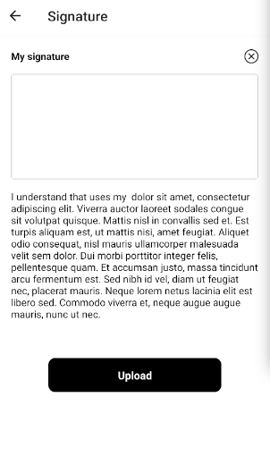

# Signature React native specs

## Module description

Signature module is React Native based module allows user to create its signature. 

- Create signature through canvas.
- Upload signature to backend.



## ## Features

- [ ] This module includes environment variables.
- [x] This module requires manual configurations.
- [ ] This module can be configured with module options.
- [ ] This module requires manual Android setup.
- [ ] This module requires manual iOS setup.

## ## 3rd party setup

No 3rd party account required.

## Dependencies

Dependencies used:
- react-native-signature-canvas - https://www.npmjs.com/package/react-native-signature-canvas
- react-native-webview - https://www.npmjs.com/package/react-native-webview

## ## Module Options

### Global Configs

Update the ``options/options.js`` file with your app's backend url. 
```js
export const globalOptions = {
    ...
  url: "https://my-app.botics.co",
   ...
}
```

### Local Configs

Update text in `modules/signature/options.js`

```js
const text = "I understand ...";
```

### Android setup

No android setup required.

### iOS setup

No iOS setup required.
