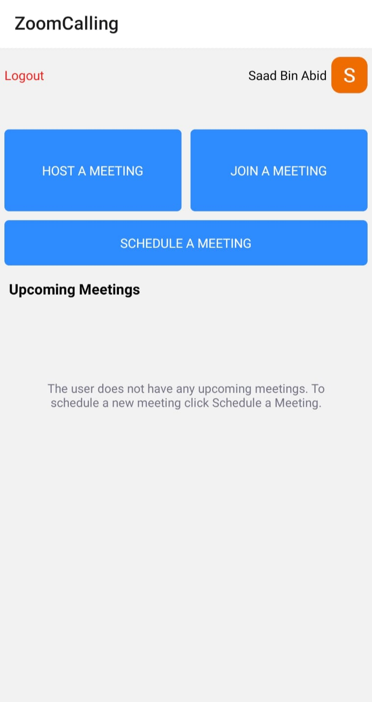

# Zoom Free Calling React native specs

## Module description

This react native based module can be used by users for managing, creating, and attending zoom meetings.

- Create Meeting
- Host Meeting
- Join Meeting
- Get Schedule List  
- Delete the Meeting



## ## Features

 - [X] This module includes environment variables.
 - [x] This module requires manual configurations.
 - [ ] This module can be configured with module options.
 - [x] This module requires manual Android setup.
 - [X] This module requires manual iOS setup.

## ## 3rd party setup

The following are the steps for credientials setup:
1. Login in to [Zoom Marketplace](https://marketplace.zoom.us/).
2. Under `Develop` dropdown click `Build app` option.
3. Select `Meeting SDK` on `Choose your app type` page.
4. Enter the name of your app click `Create` button.
5. Enter all the details required for the sdk.
6. Once your details are submitted and verified click `App Credentials` tab.
7. Copy `SDK Key`, `SDK Secret`, `Client ID` and `Client Secret` and save them for later use.


## Dependencies

Dependencies used:

- react-native-base64 - https://www.npmjs.com/package/react-native-base64
- react-native-dialog-input - https://www.npmjs.com/package/react-native-dialog-input
- react-native-paper - https://www.npmjs.com/package/react-native-paper
- react-native-dropdown-picker - https://www.npmjs.com/package/react-native-dropdown-picker
- react-native-vector-icons - https://www.npmjs.com/package/react-native-vector-icons
- react-native-webview - https://www.npmjs.com/package/react-native-webview
- react-native-zoom-us - https://www.npmjs.com/package/react-native-zoom-us
- react-native-sha256  - https://www.npmjs.com/package/react-native-sha256
- react-native-date-picker - https://www.npmjs.com/package/react-native-date-picker
- @react-native-cookies/cookies - https://www.npmjs.com/package/@react-native-cookies/cookies
- @react-native-community/checkbox - https://www.npmjs.com/package/@react-native-community/checkbox

```
Use `react-native-zoom-us`
`v6.6.1` for Old scaffold `0.64`
```

```
Use `react-native-zoom-us`
`v6.16.5` for New scaffold `0.71.7`
```


## ## Module Options

### Global Configs

No global configs required.

### Local Configs

Update these credentials in `options.js` file.

```js
CLIENT_ID = "...”
SDK_KEY = "..."
SDK_SECRET = "..."
CLIENT_SECRET = "..."
REDIRECT_URI = "https://www.crowdbotics.com"
```

### Android setup

1. Set pickFirst rules in android/app/build.gradle
```
android {
    packagingOptions {
        pickFirst 'lib/arm64-v8a/libc++_shared.so'
        pickFirst 'lib/x86/libc++_shared.so'
        pickFirst 'lib/x86_64/libc++_shared.so'
        pickFirst 'lib/armeabi-v7a/libc++_shared.so'
    }
}
```
2. In MainApplication.java inside of onCreate method add:
```
@Override
public void onCreate() {
    super.onCreate();
    SoLoader.init(this, /* native exopackage */ false);
    SoLoader.loadLibrary("zoom"); // <-- ADD THIS LINE
    return packages;
}
```

### Extra steps for new scaffold 0.71.7

1. Add these in `AndroidManifest.xml`
```xml
// In application tag
tools:replace="android:usesCleartextTraffic"
android:usesCleartextTraffic="true"

//In Manifest tag
 xmlns:tools="http://schemas.android.com/tools"
```

If your app does not connect to `Metro Server`

Step 1 : create a file in android folder `app/src/debug/res/xml/network_security_config.xml`

Step 2 : add this to `network_security_config.xml`

```xml
<?xml version="1.0" encoding="utf-8"?>
<network-security-config>
  <!-- deny cleartext traffic for React Native packager ips in release -->
  <domain-config cleartextTrafficPermitted="true">
   <domain includeSubdomains="true">localhost</domain>
   <domain includeSubdomains="true">10.0.2.2</domain>
   <domain includeSubdomains="true">10.0.3.2</domain>
  </domain-config>
</network-security-config>
```

Step 3 : Apply the config to your AndroidManifest.xml in debug folder

```xml
<application
 android:networkSecurityConfig="@xml/network_security_config">
</application>
```


### iOS setup

1. Make sure you have appropriate description in Info.plist:
```
<key>NSBluetoothPeripheralUsageDescription</key>
<string>We will use your Bluetooth to access your Bluetooth headphones.</string>
	
<key>NSCameraUsageDescription</key>
<string>For people to see you during meetings, we need access to your camera.</string>
	
<key>NSMicrophoneUsageDescription</key>
<string>For people to hear you during meetings, we need access to your microphone.</string>
	
<key>NSPhotoLibraryUsageDescription</key>
<string>For people to share, we need access to your photos.</string>
```
2. Update pods using cd ios/ && pod install && cd ..
3. Make sure to set ENABLE_BITCODE = NO; for both Debug and Release because bitcode is not supported by Zoom iOS SDK
4. Optional: Implement custom UI See [docs](https://marketplace.zoom.us/docs/sdk/native-sdks/iOS/mastering-zoom-sdk/in-meeting-function/customized-in-meeting-ui/overview/) for more details.
