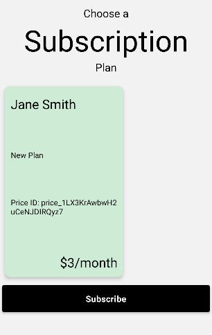

## Subscriptions React native specs

## Module description

This module enables subscription options, including one-time and recurring, as well as in-App subscriptions for iOS.

- Ability to create the subscription plans (Free, Monthly, Annual)
- Ability to get the details of subscription plans
- Ability to cancel the subscribed plans 




## Features

- [ ] This module includes environment variables.
- [x] This module requires manual configurations.
- [x] This module can be configured with module options.
- [ ] This module requires manual Android setup.
- [ ] This module requires manual iOS setup.

## 3rd party setup

Need to setup `Stripe Account`:

- Sign up for Stripe at https://dashboard.stripe.com/register.
- After successful sign up, on the dashboard click `Home` tab.
- Copy the stripe `Secrete Key` and `Publish Key` for later use.

  

## Dependencies

No dependencies used.

## Module Options

### Global configs

Update the ``options/options.js`` file with your app's backend url and other configurations.
```
export const globalOptions = {
    ...
  url: "https://my-app.botics.co",
  api: "http://192.168.100.7:8000/api/v1",
  stripeSecretKey: "sk_test_xxxxxxxx"
   ...
}
```

### Local Configs

Update the value of the option in `modules/payments/api.js`:

```js
const token = "Token c47e419eb3....";
```

### Android setup

No android setup is required.


### iOS setup

No iOS setup is required.
